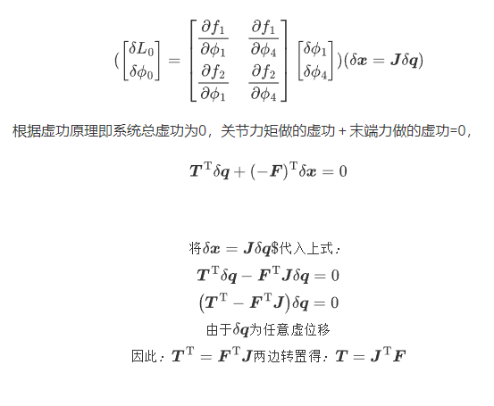
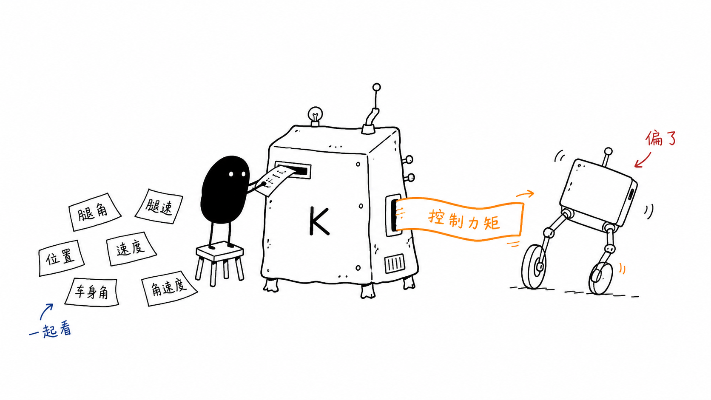
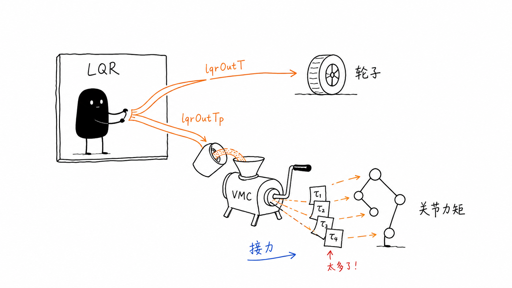

# 轮足平衡机器人控制系统 (Wheel-Legged Robot)

## 目录

- [轮足平衡机器人控制系统 (Wheel-Legged Robot)](#轮足平衡机器人控制系统-wheel-legged-robot)
  - [技术亮点](#技术亮点)
  - [硬件架构](#硬件架构)
  - [核心代码模块说明](#核心代码模块说明)
  - [蓝牙控制协议](#蓝牙控制协议)
  - [开发环境与依赖](#开发环境与依赖)
  - [完整调试流程](#完整调试流程)
    - [1.1调试准备](#11调试准备)
    - [1.2 IMU校准](#12-imu校准)
    - [1.3机器人安装事项](#13机器人安装事项)
    - [2.1调试髋部](#21调试髋部)
    - [2.2调试轮部](#22调试轮部)
    - [2.3保护措施](#23保护措施)
    - [3.1单腿起立](#31单腿起立)
    - [3.2双腿起立](#32双腿起立)
    - [3.3跳跃](#33跳跃)
    - [4.1 HTML蓝牙/键鼠控制](#41-html蓝牙键鼠控制)
  - [系统知识总结](#系统知识总结)
    - [1. VMC](#1-vmc)
      - [1.1 什么是 VMC](#11-什么是-vmc)
      - [1.2 五连杆运动学解算](#12-五连杆运动学解算)
    - [2. LQR](#2-lqr线性二次型调节器)
      - [2.1 LQR 在这里做什么](#21-lqr-在这里做什么)
      - [2.2 本项目里的状态量](#22-本项目里的状态量)
      - [2.3 输出怎么用](#23-输出怎么用)
      - [2.4 `kRatio` 调参](#24-kratio-调参)
      - [2.5 LQR 和 VMC 的分工](#25-lqr-和-vmc-的分工)
      - [2.6 常见问题](#26-常见问题)

---

这是一个基于 ESP32 的轮足平衡机器人控制工程。代码主要围绕 FreeRTOS 任务、IMU 姿态、CAN 电机反馈、LQR 平衡控制和 VMC 腿部力矩映射展开，支持站立、行走、转向、下蹲、起身和跳跃等动作。

## 技术亮点

- **LQR 平衡控制：** 用腿角、轮子位移、车身 pitch 等 6 个状态量计算轮子和腿部的平衡输出。
- **VMC 腿部映射：** 把虚拟腿的支撑力和摆角力矩换算到髋、膝关节电机。
- **起身和跳跃状态机：** 起身、下压、弹起、收腿等动作都放在控制状态机里处理。
- **BLE 网页调试：** 通过网页发送速度、航向、腿长、跳跃等指令，同时查看腿长和状态反馈。
- **反电动势补偿：** 对 4310、2804 电机做速度相关补偿，减小高速时输出变软的问题。
- **跌倒保护：** 实时检查 pitch 和 roll，超过阈值后关断电机输出。
- **电池电压补偿：** ADS1115 采集 4S 电池电压，用 `motorOutRatio` 修正不同电量下的输出比例。

## 硬件架构

- **控制器:** ESP32 (使用 PlatformIO 框架 + FreeRTOS)。
- **惯性测量单元 (IMU):** MPU6050 (I2C 总线)，使用 DMP 处理姿态，并进行软件偏航漂移补偿。
- **模数转换器 (ADC):** ADS1115 (I2C 总线)，用于 4S 锂电池组的电压监测。
- **执行器 (CAN 总线):**
  - 4x **4310 无刷电机**: 驱动髋部与膝部关节（连杆结构）。
  - 2x **2805 无刷电机**: 驱动底部轮组。
- **通信:** 1Mbps 高速 CAN 总线 (ESP32 TWAI)。

## 核心代码模块说明

| **模块名称** | **功能描述**                                                 |
| ------------ | ------------------------------------------------------------ |
| `main.cpp`   | 系统入口。初始化外设、CAN 总线、IMU，并启动 FreeRTOS 任务流。 |
| `ctrl.cpp`   | **控制核心**。包含 4ms 周期的控制环路、LQR 平衡计算、VMC 映射、串级 PID 控制以及跳跃状态机。 |
| `motor.cpp`  | 电机抽象层。管理电机减速比、安装偏移角、限压及反电动势数学模型。 |
| `legs.cpp`   | **运动学正解**。根据关节电机编码器反馈，计算当前虚拟腿的长度、角度及其导数。 |
| `can.cpp`    | TWAI 驱动实现。负责异步接收电机反馈报文并下发电压控制指令。  |
| `imu.cpp`    | 处理 MPU6050 数据，提供稳定的机身欧拉角及角速度，支持 YAW 轴漂移修正。 |
| `ble.cpp`    | 蓝牙服务器。处理来自 App 的 7 字节控制指令包，并上报机器人状态数据。 |
| `pid.cpp`    | 通用 PID 算法实现。支持死区设置、积分限幅、积分分离及误差低通滤波。 |
| `adc.cpp`    | 监测电源电压，动态计算 `motorOutRatio` 以保证控制系统的一致性。 |

## 蓝牙控制协议

机器人广播名称为 `Bot`。控制指令采用 7 字节定长数据包：`[0xA5, 指令码, 数值, 预留1, 预留2, 预留3, 0x5A]`。

- **前进/后退/旋转:** 实时调整目标速度和航向角。
- **身高调节:** 控制虚拟腿长在 0.05m 至 0.17m 之间变换。
- **跳跃:** 发送 `0x08` 触发爆发力输出序列。
- **状态反馈:** 机器人每 100ms 通过 NOTIFY 方式向 App 推送当前腿长、跳跃状态等遥测数据。

## 开发环境与依赖

1. **PlatformIO / Vscode**: 建议使用 PlatformIO 配合 ESP32 核心进行开发。
2. **必需库文件**:
   - `Adafruit_ADS1X15` (用于 ADC)。
   - `MPU6050` (带有 MotionApps20 支持的库)。
   - ESP32 自带的蓝牙与 TWAI 驱动。
3. **Matlab 支持**:
   - 项目的 LQR K 矩阵和部分复杂公式位于 `include/matlab_code/` 下，由 Matlab 符号计算工具箱导出，请勿直接修改相关头文件。

## 完整调试流程

### 1.1调试准备

调试前需要保证驱动板，主板正常工作。

驱动板事项

1. 烧录正常，stlink烧录器或者/daplink等供电时，下载完程序后offline灯常亮，旁边的灯闪烁

2. 正负极无短路，各芯片引脚无虚汗

3. 芯片电压正常为3.3v

4. AS5600：检测磁铁位置的芯片，一定要**保证I2C的SDA和SCL引脚都为高电平**，否则通信失败，读不到角度值

5. 轮子电机使用不同，孔位可能存在微妙差异，可以使用转接板，以下会附上2804电机转接板STL文件

6. 注意TJA1050T不要焊反，can通信需和主板一起通信

7. 记得修改极对数

8. 驱动板装上电机后接上串口进行校准，发送erase擦除重新校准，setid:设置id，vot:发送电压，需供电

   

   

主板事项

1. MPU6050是否焊好

2. 串口CP2102是否能正常通信，虚焊会导致下载程序失败，如果下载失败可以焊CH340试试，下载时需要先按住boot引脚不放和按一下rst引脚松开后下载，这块主板没有rst按键，可以拿锡丝接地或者esp32上的金属外壳

3. 检查5v转3v3是否正常

4. can通信是否正常，正常后驱动板只有一个led常亮

   

### 1.2 IMU校准


	给esp32主板放平后使用typec供电，点击Monitor监视，按复位按键会打印出偏移数据，填进去即可

### 1.3机器人安装事项


1. ID不可重复，将注释掉的地方取消注释将上一行注释，观察dir正负
2. 
3. 烧录后先确定dir为1或者-1，具体方法为观察串口输入的角度值，向正方向的角度旋转每个关节，如果输出对应关节的角度变大，则dir为1，反之dir为-1；先在代码中把刚刚确定的dir填写进去再编译烧录一次；
4. 确定好dir以后将4个关节都旋转到朝车头水平方向，记录下输出的角度，如果dir为1，则offsetAngle值则为输出角度，如果dir为-1，则offsetAngle为输出角度的负值；（如果车辆已经组装，部分关节无法旋转到水平超前的角度，则可以前关节朝前，后关节朝后，观察数据后关节的角度减去3.141得出的数据就是后关节的偏移角度，再根据dir的正负进行记录）
5. 通过Motor_SendTaslk直接发送电压来观察CAN是否正常
6. 轮部电机，将车身前倾，轮子应当向前，反则修改dir

### 2.1调试髋部


1. 将所选取消注释，其他任务注释，取消main函数里的控制代码注释，VMC_TestTask,中有左右单腿，和双腿测试，逐个测试
2. 修改leglengthPID使腿部具有一定抗干扰能力，增大P响应增快

### 2.2调试轮部

 调整第一行的参数会带来不同测试结果，分别与 theta dTheta  x,  dx,  phi, dPhi相乘

调试轮子时可以把髋关节电机线拔了

```c
float kRatio[2][6] = {
		{0.4f,  0.3f,  0.8f, 0.5f, 0.75f, 0.6f},	//lqrOutT		轮子
		{1.0f,1.0f,	1.2f,1.2f,1.0f,1.0f}	//lqrOutTp		髋关节
		};			
```

保持小范围内移动即可

[](https://github.com/user-attachments/assets/b8e1a997-dfb4-42a7-b6f0-01b51ff9c36e)

### 2.3保护措施

```c
bool check_Fallground(){
   		if(fabs(imuData.pitch)>FALL_PITCH_THRES||fabs(imuData.roll)>FALL_ROLL_THRES)
	{
		return true;
	}
	else{
		return false;
	}
}
```

根据角度来立即停止输出，保护电机

### 3.1单腿起立


1. 腿部分开算PID

2. ```c
   PID_CascadeCalc(&leftlegLengthPID,target.leftlegLength, leftlegLength, dleftlegLength);
   PID_CascadeCalc(&rightlegLengthPID,target.rightlegLength, rightlegLength, drightlegLength);
   ```

3. 通过分别给target.length赋值

### 3.2双腿起立

同单腿，一起给值就好

[](https://github.com/user-attachments/assets/928c907b-2759-4c30-b4f5-79027ee33e45)

### 3.3跳跃


参考达妙状态机，分为3个状态，下压，弹起，收缩转常态

跳跃时可以给目标值大一点，保证力足够

记得锁定yaw目标+清零yawPID输出

```c
target.yawAngle = imuData.yaw;
yawPID.output = 0;
target.position = stateVar.x;
target.speed = 0.0f;
```

效果一般，力不太够
[](https://github.com/user-attachments/assets/429bd7b9-4312-4c28-aed4-620284ee8f30)

### 4.1 HTML蓝牙/键鼠控制


也可以使用其他遥控器控制，这里方便看状态

## 系统知识总结

### 1. VMC

#### 1.1 什么是 VMC

VMC 指的是 Virtual Model Control，中文一般叫虚拟模型控制。这里可以简单理解成：

先不要直接想每个关节该转多少，而是先想一条“虚拟腿”应该给出多大的支撑力和摆角力矩，然后再通过几何关系换算到真实关节电机上。

这样写的好处是调腿长、调支撑力、调腿部姿态会直观一些，不用每次都从单个电机角度硬凑。

参考资料：[五连杆运动学解算与VMC](https://zhuanlan.zhihu.com/p/613007726)

#### 1.2 五连杆运动学解算

已知髋关节 A、E 两个电机角度以及大小腿长度，可以推算出五连杆机构末端 C 的位置。取 A、E 中点位置后，就能得到虚拟腿长 `L0` 和虚拟腿角 `theta0`。


雅可比矩阵描述的是两组坐标微分之间的映射关系。实际写代码时，可以从速度关系入手，推导出力和力矩在虚拟腿、关节电机之间的转换关系。

大致步骤是：对 `xb`、`xd` 的关系式求导，先求出 `theta2` 的导数，再代入 `xc`、`yc` 的导数关系里化简。

### 2. LQR（线性二次型调节器）

#### 2.1 LQR 在这里做什么

LQR 在这个工程里主要负责平衡。车身往前倒时，轮子要往前追；车身往后倒时，轮子要往后退。只看 pitch 角不够，还要同时看轮子位置、轮速、腿角这些量。

代码里最后还是很朴素的一行状态反馈：

```c
u = K * x
```

`x` 是当前状态，`K` 是反馈矩阵，`u` 是算出来的控制输出。这里不要把 LQR 想得太玄，本质上就是一组按状态量加权的反馈。



#### 2.2 本项目里的状态量

在 `src/ctrl.cpp` 中，LQR 使用 6 个状态量：

| 状态量 | 代码变量 | 含义 |
| --- | --- | --- |
| `theta` | `stateVar.theta` | 虚拟腿相对车身的角度 |
| `dTheta` | `stateVar.dTheta` | 虚拟腿角速度 |
| `x` | `stateVar.x` | 轮子累计位移 |
| `dx` | `stateVar.dx` | 轮子线速度 |
| `phi` | `stateVar.phi` | 车身 pitch 角 |
| `dPhi` | `stateVar.dPhi` | 车身 pitch 角速度 |

代码中实际组包如下：

```c
float x[6] = {
    stateVar.theta,
    stateVar.dTheta,
    stateVar.x,
    stateVar.dx,
    stateVar.phi,
    stateVar.dPhi
};

x[2] -= target.position;
x[3] -= target.speed;
```

这里 `theta / dTheta / phi / dPhi` 的目标基本按 0 来看，也就是腿和车身回到平衡附近；`x / dx` 会减去目标位置和目标速度，用来做前进、后退或者定点。

#### 2.3 输出怎么用

`lqr_k(legLength, kRes)` 会根据当前腿长算反馈矩阵。腿长变了，重心和模型参数也变，所以这里没有只用一组固定 K。

代码里把 `kRes` 整理成 2 行 6 列：

```c
float kRes[12] = {0}, k[2][6] = {0};
lqr_k(legLength, kRes);

for (int i = 0; i < 6; i++)
{
    for (int j = 0; j < 2; j++)
        k[j][i] = kRes[i * 2 + j] * kRatio[j][i];
}
```

这里的两路输出分别是：

| 输出量 | 作用对象 | 作用 |
| --- | --- | --- |
| `lqrOutT` | 左右轮电机 | 让轮子前后运动，追住车身重心 |
| `lqrOutTp` | 髋部/腿部虚拟力矩 | 调整虚拟腿角度，辅助车身姿态稳定 |

对应代码：

```c
float lqrOutT =
    k[0][0] * x[0] + k[0][1] * x[1] +
    k[0][2] * x[2] + k[0][3] * x[3] +
    k[0][4] * x[4] + k[0][5] * x[5];

float lqrOutTp =
    k[1][0] * x[0] + k[1][1] * x[1] +
    k[1][2] * x[2] + k[1][3] * x[3] +
    k[1][4] * x[4] + k[1][5] * x[5];
```

轮子这一路直接给左右轮，再叠加 yaw 控制：

```c
Motor_SetTorque(&leftWheel, -lqrOutT * lqrTRatio - yawPID.output);
Motor_SetTorque(&rightWheel, -lqrOutT * lqrTRatio + yawPID.output);
```

腿部这一路不是直接给某个关节，而是先作为虚拟腿角力矩 `Tp`，再交给 VMC 换算成左右腿各关节力矩。

#### 2.4 `kRatio` 调参

`lqr_k()` 给的是理论矩阵，真机还会受电机方向、装配误差、摩擦、电池电压、腿长误差影响，所以代码里留了一层 `kRatio`：

```c
float kRatio[2][6] = {
    {0.4f, 0.1f, 1.0f, 0.7f, 0.75f, 0.75f}, // lqrOutT  轮子
    {1.0f, 1.0f, 0.8f, 0.5f, 0.0f, 0.0f}    // lqrOutTp 髋关节
};
```

调的时候建议按这个顺序来：

1. 先确认 IMU 方向和轮电机方向。车身前倾时，轮子应该向前追；如果反了，先改方向。
2. 先固定腿长调平衡，再调变腿长、下蹲、起跳。腿长变化会改变 `lqr_k(legLength)` 的输出。
3. `phi / dPhi` 太小会扶不住车身，太大容易抖；`x / dx` 太大容易前后冲。
4. `theta / dTheta` 影响虚拟腿摆角参与程度，髋关节力矩过猛时优先降低第二行对应比例。
5. 起跳或腾空阶段可以临时降低 `lqrTRatio / lqrTpRatio`，避免空中乱补偿；落地后再恢复。

#### 2.5 LQR 和 VMC 的分工

LQR 管“整车怎么稳”：轮子给多少前后力矩，虚拟腿给多少姿态力矩。

VMC 管“这些虚拟力怎么落到关节上”：把腿长方向的力 `F` 和腿角方向的力矩 `Tp`，通过五连杆雅可比矩阵映射到左右髋、膝关节电机。

整体链路大概是这样：

```text
IMU + 轮速 + 腿部编码器
        ↓
6状态量 theta / dTheta / x / dx / phi / dPhi
        ↓
LQR 计算 lqrOutT / lqrOutTp
        ↓
轮电机直接输出 lqrOutT
髋膝关节经 VMC 把 lqrOutTp 映射为关节力矩
```



#### 2.6 常见问题

- **一上电就飞车：** 优先检查 IMU pitch 正负、轮电机方向、`target.position = stateVar.x` 是否及时同步。
- **能站但来回大幅摆动：** 降低 `phi / dPhi` 或 `x / dx` 对轮子输出的比例，确认控制周期稳定在 4ms。
- **腿部抖动或互相打架：** 降低 `lqrOutTp` 对应的 `kRatio`，再检查左右腿角度、关节方向和 VMC 映射正负。
- **起跳后轮子乱转：** 腾空阶段切断或降低 LQR 输出，落地检测后再恢复。


