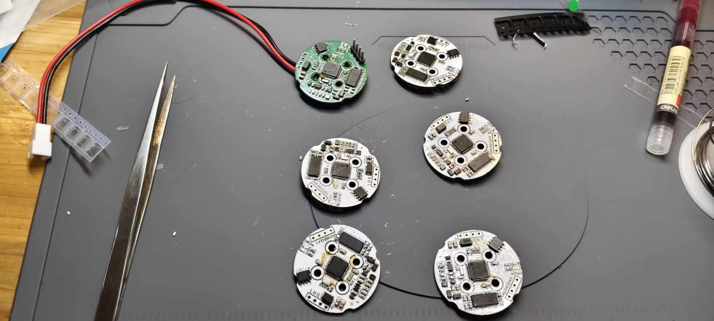
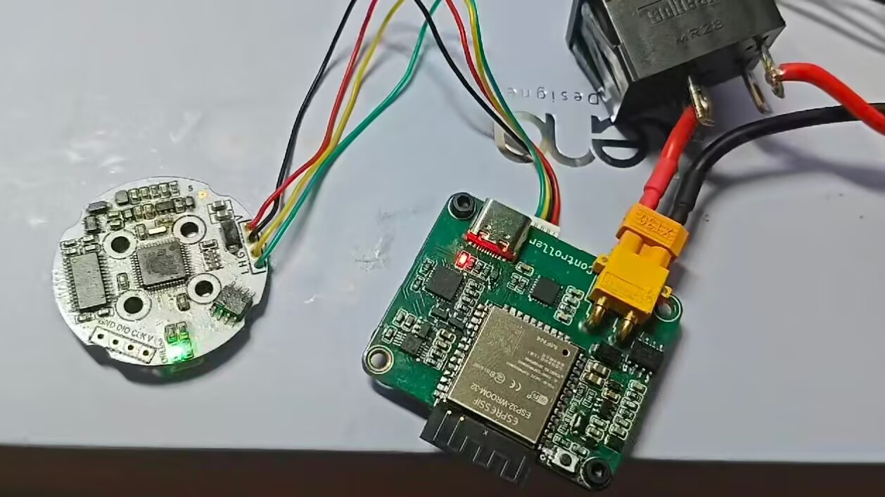
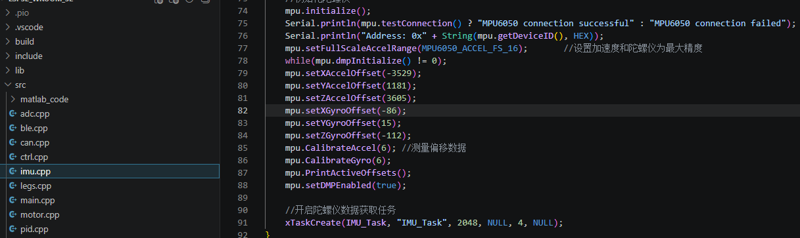
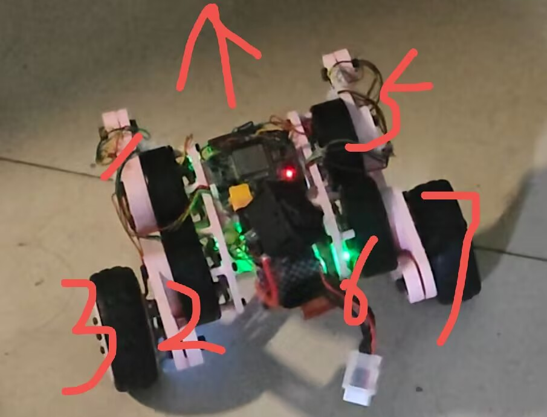
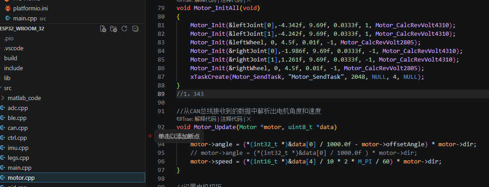
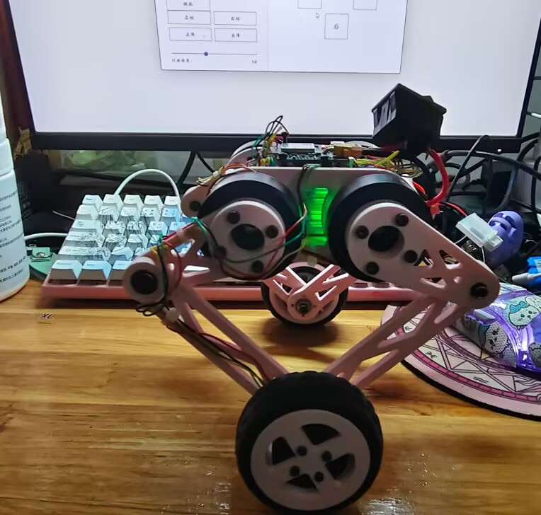
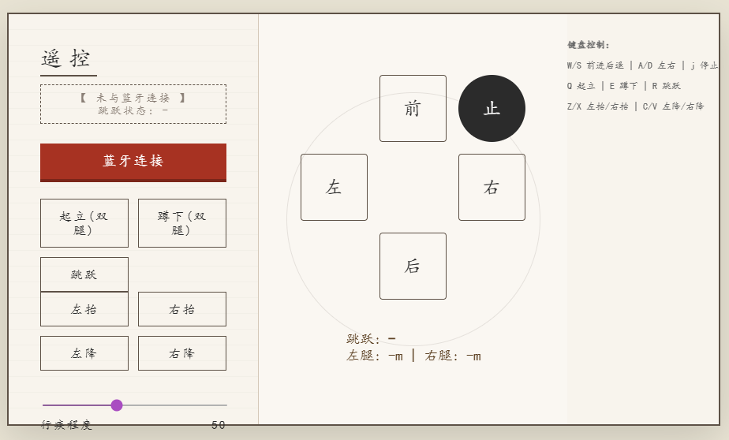

# 轮足平衡机器人控制系统 (Wheel-Legged Robot)

## 📑 目录

- [轮足平衡机器人控制系统 (Wheel-Legged Robot)](#轮足平衡机器人控制系统-wheel-legged-robot)
  - [✨ 技术亮点](#-技术亮点)
  - [🛠️ 硬件架构](#️-硬件架构)
  - [📂 核心代码模块说明](#-核心代码模块说明)
  - [🎮 蓝牙控制协议](#-蓝牙控制协议)
  - [🔧 开发环境与依赖](#-开发环境与依赖)
  - [完整调试流程](#完整调试流程)
    - [1.1调试准备](#11调试准备)
    - [1.2 IMU校准](#12-imu校准)
    - [1.3机器人安装事项](#13机器人安装事项)
    - [2.1调试髋部](#21调试髋部)
    - [2.2调试轮部](#22调试轮部)
    - [2.3保护措施](#23保护措施)
    - [3.1单腿起立](#31单腿起立)
    - [4.1html蓝牙/键鼠控制](#41html蓝牙键鼠控制)

---

本项目是基于 ESP32 开发的轮足平衡（轮式双足）机器人控制固件。该系统利用 FreeRTOS 实时操作系统进行多任务管理，并结合 **LQR（线性二次型调节器）** 与 **VMC（虚拟模型控制）** 等先进控制算法，实现了机器人的动态自平衡、行走、转向、深蹲及跳跃等高级动态行为。

## ✨ 技术亮点

- **动态自平衡 (LQR):** 基于 6 变量状态空间模型（机身倾角、位移、腿部角度及其导数），通过 LQR 算法实时计算车轮力矩，维持机器人站立平衡。
- **虚拟模型控制 (VMC):** 将复杂的连杆结构简化为“虚拟腿”，通过控制虚拟弹簧和阻尼器的出力，实现对腿长和腿部角度的直观解耦控制。
- **跳跃与自动起身:** 内置有限状态机，支持垂直跳跃。
- **BLE 远程控制:** 集成蓝牙低功耗（BLE）服务，支持网页Html 实时调节机器人位姿（速度、航向、腿长、跳跃），并观察状态和腿长。
- **反电动势补偿 (Back-EMF):** 针对 4310 和 2804 无刷电机进行非线性反电动势补偿，确保在高速运动下力矩输出依然精准一致。
- **主动安全保障:** 实时监测机身 pitch 和 roll 角。若检测到跌倒，系统将立即切断所有电机输出以防止硬件损坏。
- **电池压降补偿:** 通过 ADS1115 高精度 ADC 监测电压，自动调整电机输出比例，消除因电池电量下降导致的控制增益波动。

## 🛠️ 硬件架构

- **控制器:** ESP32 (使用Platformio框架 + FreeRTOS)。
- **惯性测量单元 (IMU):** MPU6050 (I2C 总线)，使用 DMP 处理姿态，并进行软件偏航漂移补偿。
- **模数转换器 (ADC):** ADS1115 (I2C 总线)，用于 4S 锂电池组的电压监测。
- **执行器 (CAN 总线):**
  - 4x **4310 无刷电机**: 驱动髋部与膝部关节（连杆结构）。
  - 2x **2805 无刷电机**: 驱动底部轮组。
- **通信:** 1Mbps 高速 CAN 总线 (ESP32 TWAI)。

## 📂 核心代码模块说明

| **模块名称** | **功能描述**                                                 |
| ------------ | ------------------------------------------------------------ |
| `main.cpp`   | 系统入口。初始化外设、CAN 总线、IMU，并启动 FreeRTOS 任务流。 |
| `ctrl.cpp`   | **控制核心**。包含 4ms 周期的控制环路、LQR 平衡计算、VMC 映射、串级 PID 控制以及跳跃状态机。 |
| `motor.cpp`  | 电机抽象层。管理电机减速比、安装偏移角、限压及反电动势数学模型。 |
| `legs.cpp`   | **运动学正解**。根据关节电机编码器反馈，计算当前虚拟腿的长度、角度及其导数。 |
| `can.cpp`    | TWAI 驱动实现。负责异步接收电机反馈报文并下发电压控制指令。  |
| `imu.cpp`    | 处理 MPU6050 数据，提供稳定的机身欧拉角及角速度，支持 YAW 轴漂移修正。 |
| `ble.cpp`    | 蓝牙服务器。处理来自 App 的 7 字节控制指令包，并上报机器人状态数据。 |
| `pid.cpp`    | 通用 PID 算法实现。支持死区设置、积分限幅、积分分离及误差低通滤波。 |
| `adc.cpp`    | 监测电源电压，动态计算 `motorOutRatio` 以保证控制系统的一致性。 |

## 🎮 蓝牙控制协议

机器人广播名称为 `Bot`。控制指令采用 7 字节定长数据包：`[0xA5, 指令码, 数值, 预留1, 预留2, 预留3, 0x5A]`。

- **前进/后退/旋转:** 实时调整目标速度和航向角。
- **身高调节:** 控制虚拟腿长在 0.05m 至 0.17m 之间变换。
- **跳跃:** 发送 `0x08` 触发爆发力输出序列。
- **状态反馈:** 机器人每 100ms 通过 NOTIFY 方式向 App 推送当前腿长、跳跃状态等遥测数据。

## 🔧 开发环境与依赖

1. **PlatformIO / Vscode**: 建议使用 PlatformIO 配合 ESP32 核心进行开发。
2. **必需库文件**:
   - `Adafruit_ADS1X15` (用于 ADC)。
   - `MPU6050` (带有 MotionApps20 支持的库)。
   - ESP32 自带的蓝牙与 TWAI 驱动。
3. **Matlab 支持**:
   - 项目的 LQR K 矩阵和部分复杂公式位于 `include/matlab_code/` 下，由 Matlab 符号计算工具箱导出，请勿直接修改相关头文件。

## 完整调试流程

### 1.1调试准备

调试前需要保证驱动板，主板正常工作。

驱动板事项

1. 烧录正常，stlink烧录器或者/daplink等供电时，下载完程序后offline灯常亮，旁边的灯闪烁

2. 正负极无短路，各芯片引脚无虚汗

3. 芯片电压正常为3.3v

4. AS5600：检测磁铁位置的芯片，一定要**保证I2C的SDA和SCL引脚都为高电平**，否则通信失败，读不到角度值

5. 轮子电机使用不同，孔位可能存在微妙差异，可以使用转接板，以下会附上2804电机转接板STL文件

6. 注意TJA1050T不要焊反，can通信需和主板一起通信

7. 记得修改极对数

8. 驱动板装上电机后接上串口进行校准，发送erase擦除重新校准，setid:设置id，vot:发送电压，需供电

   

   

主板事项

1. MPU6050是否焊好

2. 串口CP2102是否能正常通信，虚焊会导致下载程序失败，如果下载失败可以焊CH340试试，下载时需要先按住boot引脚不放和按一下rst引脚松开后下载，这块主板没有rst按键，可以拿锡丝接地或者esp32上的金属外壳

3. 检查5v转3v3是否正常

4. can通信是否正常，正常后驱动板只有一个led常亮

   

### 1.2 IMU校准



​	给esp32主板放平后使用typec供电，点击Monitor监视，按复位按键会打印出偏移数据，填进去即可

### 1.3机器人安装事项



1. ID不可重复，将注释掉的地方取消注释将上一行注释，观察dir正负
2. 
3. 烧录后先确定dir为1或者-1，具体方法为观察串口输入的角度值，向正方向的角度旋转每个关节，如果输出对应关节的角度变大，则dir为1，反之dir为-1；先在代码中把刚刚确定的dir填写进去再编译烧录一次；
4. 确定好dir以后将4个关节都旋转到朝车头水平方向，记录下输出的角度，如果dir为1，则offsetAngle值则为输出角度，如果dir为-1，则offsetAngle为输出角度的负值；（如果车辆已经组装，部分关节无法旋转到水平超前的角度，则可以前关节朝前，后关节朝后，观察数据后关节的角度减去3.141得出的数据就是后关节的偏移角度，再根据dir的正负进行记录）
5. 通过Motor_SendTaslk直接发送电压来观察CAN是否正常
6. 轮部电机，将车身前倾，轮子应当向前，反则修改dir

### 2.1调试髋部


1. 将所选取消注释，其他任务注释，取消main函数里的控制代码注释，VMC_TestTask,中有左右单腿，和双腿测试，逐个测试
2. 修改leglengthPID使腿部具有一定抗干扰能力，增大P响应增快

### 2.2调试轮部

 调整第一行的参数会带来不同测试结果，分别与 theta dTheta  x,  dx,  phi, dPhi相乘

调试轮子时可以把髋关节电机线拔了

```c
float kRatio[2][6] = {
		{0.4f,  0.3f,  0.8f, 0.5f, 0.75f, 0.6f},	//lqrOutT		轮子
		{1.0f,1.0f,	1.2f,1.2f,1.0f,1.0f}	//lqrOutTp		髋关节
		};			
```
保持小范围内移动即可
[[[https://github.com/oyzlight/Wheel_legged_robot/issues/1#issuecomment-4350559435](https://github.com/user-attachments/assets/b8e1a997-dfb4-42a7-b6f0-01b51ff9c36e)](https://github.com/oyzlight/Wheel_legged_robot/issues/1#issuecomment-4350559435)](https://github.com/user-attachments/assets/b8e1a997-dfb4-42a7-b6f0-01b51ff9c36e

)
### 2.3保护措施

```c
bool check_Fallground(){
   		if(fabs(imuData.pitch)>FALL_PITCH_THRES||fabs(imuData.roll)>FALL_ROLL_THRES)
	{
		return true;
	}
	else{
		return false;
	}
}
```

根据角度来立即停止输出，保护电机

### 3.1单腿起立



1. 腿部分开算PID

2. ```c
   PID_CascadeCalc(&leftlegLengthPID,target.leftlegLength, leftlegLength, dleftlegLength);
   PID_CascadeCalc(&rightlegLengthPID,target.rightlegLength, rightlegLength, drightlegLength);
   ```

3. 通过分别给target.length赋值

### 3.2双腿起立

同单腿，一起给值就好
https://github.com/user-attachments/assets/facdec61-1ea6-4ca2-bf08-76cfcfcfa08b

### 3.3跳跃

参考达妙状态机，分为3个状态，下压，弹起，收缩转常态

跳跃时可以给目标值大一点，保证力足够

记得锁定yaw目标+清零yawPID输出

```c
target.yawAngle = imuData.yaw;
yawPID.output = 0;
target.position = stateVar.x;
target.speed = 0.0f;
```
效果一般，力不太够
[<video src="./image/jump.mp4" controls width="600"></video>](https://github.com/user-attachments/assets/facdec61-1ea6-4ca2-bf08-76cfcfcfa08b)
### 4.1html蓝牙/键鼠控制



也可以使用其他遥控器控制，这里方便看状态
